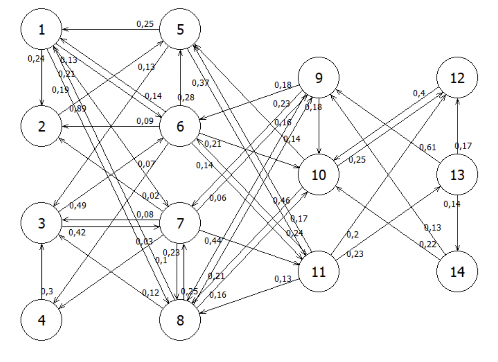
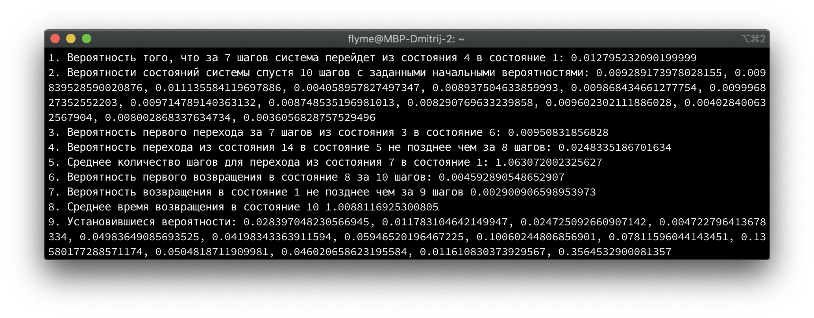
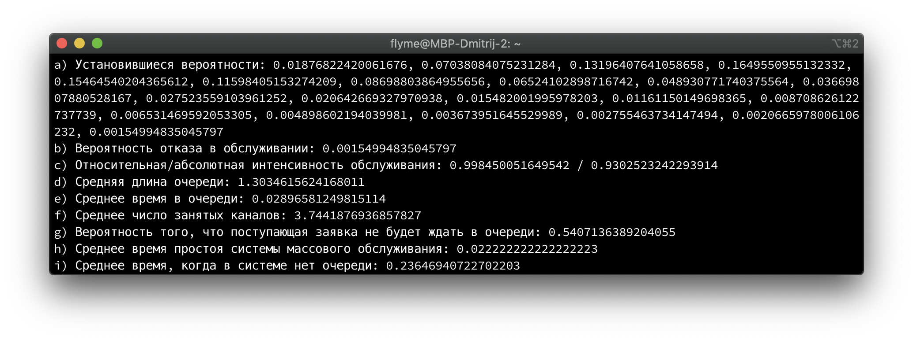

## Задание 1
Система имеем 14 дискретных состояний. Изменение состояний происходит в дискретные моменты времени с заданной вероятность. Схема марковского процесса изображена на рисунке. 

Требуется определить:
1) Вероятность того, что за 7 шагов система перейдет из состояния 4 в состояние 1;
2) Вероятности состояний системы спустя 10 шагов, если в начальный момент вероятность состояний были следующими A=(0,08;0,1;0,13;0,09;0,08;0,01;0,1;0,02;0,12;0,05;0,09;0,05;0,06;0,02);
3) Вероятность первого перехода за 7 шагов из состояния 3 в состояние 6;
4) Вероятность перехода из состояния 14 в состояние 5 не позднее чем за 8 шагов;
5) Вреднее количество шагов для перехода из состояния 7 в состояние 1;
6) Вероятность первого возвращения в состояние 8 за 10 шагов;
7) Вероятность возвращения в состояние 1 не позднее чем за 9 шагов;
8) Среднее время возвращения в состояние 10;
9) Установившиеся вероятности.

#### Входные данные
|  | 1 | 2 | 3 | 4 | 5 | 6 | 7 | 8 | 9 | 10 | 11 | 12 | 13 | 14 |
|--------|------|------|------|------|------|------|------|------|------|------|------|------|------|------|
| **1** | 0.0 | 0.24 | 0.0 | 0.0 | 0.0 | 0.13 | 0.21 | 0.19 | 0.0 | 0.0 | 0.0 | 0.0 | 0.0 | 0.0 |
| **2** | 0.0 | 0.0 | 0.0 | 0.0 | 0.89 | 0.0 | 0.0 | 0.0 | 0.0 | 0.0 | 0.0 | 0.0 | 0.0 | 0.0 |
| **3** | 0.0 | 0.0 | 0.0 | 0.0 | 0.0 | 0.49 | 0.42 | 0.0 | 0.0 | 0.0 | 0.0 | 0.0 | 0.0 | 0.0 |
| **4** | 0.0 | 0.0 | 0.3 | 0.0 | 0.0 | 0.0 | 0.0 | 0.0 | 0.0 | 0.0 | 0.0 | 0.0 | 0.0 | 0.0 |
| **5** | 0.25 | 0.0 | 0.13 | 0.0 | 0.0 | 0.0 | 0.0 | 0.0 | 0.0 | 0.0 | 0.37 | 0.0 | 0.0 | 0.0 |
| **6** | 0.14 | 0.09 | 0.0 | 0.07 | 0.28 | 0.0 | 0.0 | 0.0 | 0.0 | 0.21 | 0.14 | 0.0 | 0.0 | 0.0 |
| **7** | 0.0 | 0.02 | 0.08 | 0.03 | 0.0 | 0.0 | 0.0 | 0.23 | 0.06 | 0.0 | 0.44 | 0.0 | 0.0 | 0.0 |
| **8** | 0.1 | 0.0 | 0.12 | 0.0 | 0.0 | 0.0 | 0.25 | 0.0 | 0.21 | 0.16 | 0.0 | 0.0 | 0.0 | 0.0 |
| **9** | 0.0 | 0.0 | 0.0 | 0.0 | 0.0 | 0.18 | 0.23 | 0.16 | 0.0 | 0.18 | 0.0 | 0.0 | 0.0 | 0.0 |
| **10** | 0.0 | 0.0 | 0.0 | 0.0 | 0.14 | 0.0 | 0.0 | 0.46 | 0.0 | 0.0 | 0.0 | 0.25 | 0.0 | 0.0 |
| **11** | 0.0 | 0.0 | 0.0 | 0.0 | 0.17 | 0.24 | 0.0 | 0.13 | 0.0 | 0.0 | 0.0 | 0.2 | 0.23 | 0.0 |
| **12** | 0.0 | 0.0 | 0.0 | 0.0 | 0.0 | 0.0 | 0.0 | 0.0 | 0.0 | 0.4 | 0.0 | 0.0 | 0.0 | 0.0 |
| **13** | 0.0 | 0.0 | 0.0 | 0.0 | 0.0 | 0.0 | 0.0 | 0.0 | 0.61 | 0.0 | 0.0 | 0.17 | 0.0 | 0.14 |
| **14** | 0.0 | 0.0 | 0.0 | 0.0 | 0.0 | 0.0 | 0.0 | 0.0 | 0.13 | 0.22 | 0.0 | 0.0 | 0.0 | 0.0 |

#### Код
```python
import csv
from abc import ABCMeta, abstractmethod
from functools import lru_cache

from numpy import array, zeros, linalg, dot, eye
from numpy.linalg import matrix_power


class Markov(metaclass=ABCMeta):

    matrix: array

    def __init__(self, matrix: array):
        self.matrix = matrix

    @classmethod
    def read_from_file(cls, filename: str) -> "Markov":
        """
        Открывает CVS файл и преобразует в array
        :param filename:
        :return:
        """
        with open(filename, encoding="utf-8") as file:
            return cls(array([list(map(float, row)) for row in csv.reader(file)]))

    @abstractmethod
    def probability_of_switching_to_state(self, of: int, to: int, n: int):
        pass

    @abstractmethod
    def probabilities_of_system_states_in_n_steps(
        self, n: int, start_step: array
    ) -> array:
        pass

    @abstractmethod
    def make_step_in_matrix(self, matrix: array) -> array:
        pass

    @abstractmethod
    def probability_of_the_first_transition(self, of: int, to: int, n: int) -> float:
        pass

    @abstractmethod
    def probability_of_transition_no_later_than(
        self, of: int, to: int, n: int
    ) -> float:
        pass

    @abstractmethod
    def average_number_of_steps_for_the_transition(self, of: int, to: int) -> float:
        pass

    @abstractmethod
    def probability_of_first_return(self, of: int, n: int) -> float:
        pass

    @abstractmethod
    def probability_of_return_no_later_than(self, of: int, n: int) -> float:
        pass

    @abstractmethod
    def average_time_of_return(self, of: int) -> float:
        pass

    @abstractmethod
    def steady_state_probability(self):
        pass


class MarkovProcess(Markov):
    def probability_of_switching_to_state(self, of: int, to: int, n: int) -> float:
        """
        Вероятность перехода в состояние
        
        :param of: 
        :param to: 
        :param n: 
        :return: 
        """
        return matrix_power(self.matrix, n)[of - 1, to - 1]

    def probabilities_of_system_states_in_n_steps(
        self, n: int, start_step: array
    ) -> array:
        """
        Вероятности состояний системы через n шагов с начальными данными

        :param n:
        :param start_step:
        :return:
        """

        return dot(matrix_power(self.matrix, n), start_step)

    def make_step_in_matrix(self, matrix: array) -> array:
        """
        Совершает переход

        :param matrix: матрица
        :return:
        """

        new = zeros(self.matrix.shape)
        for i in range(self.matrix.shape[0]):
            for j in range(self.matrix.shape[1]):
                new[i, j] = sum(
                    self.matrix[i, m] * matrix[m, j] if m != j else 0
                    for m in range(self.matrix.shape[0])
                )
        return new

    def probability_of_the_first_transition(self, of: int, to: int, n: int) -> float:
        """
        Вероятность первого перехода

        :param of:
        :param to:
        :param n:
        :return:
        """

        final = self.matrix
        for _ in range(2, n + 1):
            final = self.make_step_in_matrix(final)
        return final[of - 1, to - 1]

    def probability_of_transition_no_later_than(
        self, of: int, to: int, n: int
    ) -> float:
        """
        Вероятность перехода не позднее чем

        :param of:
        :param to:
        :param n:
        :return:
        """

        return sum(
            self.probability_of_the_first_transition(of - 1, to - 1, step)
            for step in range(1, n + 1)
        )

    def average_number_of_steps_for_the_transition(self, of: int, to: int) -> float:
        """
        Среднее количество шагов для перехода

        :param of:
        :param to:
        :return:
        """

        of, to = map(lambda x: x - 1, (of, to))
        temp_matrix = self.matrix
        res = temp_matrix[of, to]
        for step in range(2, 1000):
            temp_matrix = self.make_step_in_matrix(temp_matrix)
            res += step * temp_matrix[of, to]
        return res

    @lru_cache(maxsize=None)
    def probability_of_first_return(self, of: int, n: int) -> float:
        """
        Вероятность первого возвращения

        :param of:
        :param n:
        :return:
        """

        s = zeros(self.matrix.shape)
        for step in range(1, n):
            s += self.probability_of_first_return(of, step) * matrix_power(
                self.matrix, n - step
            )
        return (matrix_power(self.matrix, n) - s)[of - 1, of - 1]

    def probability_of_return_no_later_than(self, of: int, n: int) -> float:
        """
        Вероятность возвращения не позднее чем

        :param of:
        :param n:
        :return:
        """

        return sum(
            self.probability_of_first_return(of - 1, step) for step in range(1, n + 1)
        )

    def average_time_of_return(self, of: int) -> float:
        """
        Среднее время возвращения

        :param of:
        :return:
        """

        return sum(
            step * self.probability_of_first_return(of - 1, step)
            for step in range(1, 130)
        )

    def steady_state_probability(self) -> array:
        """
        Установившиеся вероятности

        :return:
        """

        m = self.matrix.T - eye(self.matrix.shape[0])
        m[-1, :] = 1
        b = array([0] * (self.matrix.shape[0] - 1) + [1])
        x = dot(linalg.inv(m), b)
        return x


def main():
    markov_process: MarkovProcess = MarkovProcess.read_from_file("matrix.csv")

    task_1 = markov_process.probability_of_switching_to_state(4, 5, 7)
    print(
        f"1. Вероятность того, что за 7 шагов система перейдет из состояния 4 в состояние 1: {task_1}"
    )

    task_2 = markov_process.probabilities_of_system_states_in_n_steps(
        10,
        array(
            (
                0.08,
                0.1,
                0.13,
                0.09,
                0.08,
                0.01,
                0.1,
                0.02,
                0.12,
                0.05,
                0.09,
                0.05,
                0.06,
                0.02,
            )
        ),
    )
    print(
        f"2. Вероятности состояний системы спустя 10 шагов с заданными начальными вероятностями: {', '.join(map(str, task_2))}"
    )

    task_3 = markov_process.probability_of_the_first_transition(3, 6, 7)
    print(
        f"3. Вероятность первого перехода за 7 шагов из состояния 3 в состояние 6: {task_3}"
    )

    task_4 = markov_process.probability_of_transition_no_later_than(14, 5, 8)
    print(
        f"4. Вероятность перехода из состояния 14 в состояние 5 не позднее чем за 8 шагов: {task_4}"
    )

    task_5 = markov_process.average_number_of_steps_for_the_transition(7, 1)
    print(
        f"5. Среднее количество шагов для перехода из состояния 7 в состояние 1: {task_5}"
    )

    task_6 = markov_process.probability_of_first_return(8, 10)
    print(f"6. Вероятность первого возвращения в состояние 8 за 10 шагов: {task_6}")

    task_7 = markov_process.probability_of_return_no_later_than(1, 9)
    print(
        f"7. Вероятность возвращения в состояние 1 не позднее чем за 9 шагов {task_7}"
    )

    task_8 = markov_process.average_time_of_return(10)
    print(f"8. Среднее время возвращения в состояние 10 {task_8}")

    task_9 = markov_process.steady_state_probability()
    print(f"9. Установившиеся вероятности: {', '.join(map(str, task_9))}")


if __name__ == "__main__":
    main()
```
#### Ответы

## Задание 2
Задана система массового обслуживания со следующими характеристиками:
- Интенсивность поступления			`λ=45`
- Каналов обслуживания				`m=5`
- Интенсивность обслуживания		`μ=12`
- Максимальный размер очереди		`n=15`

Изначально требований в системе нет
1)	Составьте граф марковского процесса, запишите систему уравнений Колмогорова и найдите установившиеся вероятности состояний.
2)	Найдите вероятность отказа в обслуживании.
3)	Найдите относительную и абсолютную интенсивность обслуживания.
4)	Найдите среднюю длину в очереди.
5)	Найдите среднее время в очереди.
6)	Найдите среднее число занятых каналов.
7)	Найдите вероятность того, что поступающая заявка не будет ждать в очереди.
8)	Найти среднее время простоя системы массового обслуживания.
9)	Найти среднее время, когда в системе нет очереди.

#### Код
```python
import numpy as np


class QueueingSystem:
    matrix: np.array
    stable_condition: np.array

    def __init__(self, arriving: int, channels: int, intensity: int, max_size: int):
        self.arriving = arriving
        self.channels = channels
        self.intensity = intensity
        self.max_size = max_size
        self.matrix = self.creation_of_transition_matrix(
            arriving, channels, intensity, max_size
        )
        self.stable_condition = self.establishment_of_the_steady_state_probabilities(
            self.matrix
        )

    @staticmethod
    def creation_of_transition_matrix(
        arriving: int, channels: int, intensity: int, max_size: int
    ) -> np.array:
        """
        Создание матрицы переходов

        :param arriving:
        :param channels:
        :param intensity:
        :param max_size:
        :return:
        """

        matrix = np.zeros((channels + max_size + 1, channels + max_size + 1))
        for i in range(channels + max_size):
            matrix[i, i + 1] = arriving
            matrix[i + 1, i] = (
                intensity * (i + 1) if i < channels else intensity * channels
            )
        return matrix

    @staticmethod
    def establishment_of_the_steady_state_probabilities(matrix: np.array) -> np.array:
        """
        Установившиеся вероятности

        :param matrix:
        :return:
        """

        new = matrix.T - np.diag([matrix[i, :].sum() for i in range(matrix.shape[0])])
        new[-1, :] = 1
        zeros = np.zeros(new.shape[0])
        zeros[-1] = 1
        return np.linalg.inv(new).dot(zeros)

    def probability_of_denial_of_service(self) -> float:
        """
        Вероятность отказа в обслуживании

        :return:
        """

        return self.stable_condition[-1]

    def bandwidth(self, absolute: bool = False) -> float:
        """
        Пропускная способность

        :param absolute:
        :return:
        """

        return (
            1 - self.stable_condition[-1] * self.arriving
            if absolute
            else 1 - self.stable_condition[-1]
        )

    def average_length_of_the_queue(self) -> float:
        """
        Средняя длина очереди

        :return:
        """

        return sum(
            i * self.stable_condition[self.channels + i]
            for i in range(1, self.max_size + 1)
        )

    def average_time_in_the_queue(self) -> float:
        """
        Среднее время в очереди

        :return:
        """

        return sum(
            (i + 1)
            / (self.channels * self.intensity)
            * self.stable_condition[self.channels + i]
            for i in range(self.max_size)
        )

    def average_number_of_busy_channels(self) -> float:
        """
        Среднее число занятых каналов

        :return:
        """

        return sum(
            i * self.stable_condition[i] for i in range(1, self.channels + 1)
        ) + sum(
            self.channels * self.stable_condition[i]
            for i in range(self.channels + 1, self.channels + self.max_size + 1)
        )

    def probability_that_the_incoming_request_will_not_wait_in_the_queue(self) -> float:
        """
        Вероятность что поступающая заявка не будет ждать в очереди

        :return:
        """

        return sum(self.stable_condition[: self.channels])

    def average_downtime(self) -> float:
        """
        Среднее время простоя

        :return:
        """

        return 1 / self.arriving

    def average_time_when_there_is_no_queue_in_the_system(self) -> float:
        """
        Среднее время, когда в системе нет очереди

        :return:
        """

        probabilities = {i: self.stable_condition[i] for i in range(self.channels + 1)}
        normal_coefficient = 1 / sum(probabilities.values())
        probabilities = {k: v * normal_coefficient for k, v in probabilities.items()}
        return self.time_spent_in_a_subset(
            set(probabilities.keys()), probabilities, 0.0005, 10
        )

    def time_spent_in_a_subset(
        self, subset: set, probabilities: dict, time_step: float, time: int
    ) -> float:
        """
        Время пребывания в подмножестве

        :param subset: список состояний
        :param probabilities: вероятности
        :param time_step: шаг времени
        :param time: полное время проведения испытаний
        :return: время нахождения
        """

        buffer_array = np.zeros(self.matrix.shape)
        for i in subset:
            for j in range(self.matrix.shape[0]):
                buffer_array[j][i] = self.matrix[i][j]
        for i in subset:
            for j in range(self.matrix.shape[0]):
                if j != i:
                    buffer_array[i][i] -= self.matrix[i][j]

        not_subset, f = set(range(self.matrix.shape[0])) - subset, 0
        for t in np.arange(time_step, time + time_step, time_step):
            probabilities = self.probability_search(
                buffer_array, subset, probabilities, time_step
            )
            f += t * sum(
                probabilities[i] * self.matrix[i][j] for j in not_subset for i in subset
            )
        return f * time_step

    @staticmethod
    def probability_search(
        buffer_array: np.ndarray, subset: set, probabilities: list, time: float
    ) -> list:
        """
        Поиск вероятности

        :param buffer_array:
        :param subset:
        :param probabilities:
        :param time:
        :return:
        """

        coefficients = {x: [0, 0, 0, 0] for x in subset}
        for i in subset:
            for j in subset:
                coefficients[i][0] += buffer_array[i][j] * probabilities[j]
            for j in subset:
                coefficients[i][1] += (buffer_array[i][j]) * (
                    probabilities[j] + coefficients[i][0] * time / 2
                )
            for j in subset:
                coefficients[i][2] += (buffer_array[i][j]) * (
                    probabilities[j] + coefficients[i][1] * time / 2
                )
            for j in subset:
                coefficients[i][3] += (buffer_array[i][j]) * (
                    probabilities[j] + coefficients[i][2] * time
                )
        return [
            (
                probabilities[x]
                + time
                * (
                    coefficients[x][0]
                    + 2 * coefficients[x][1]
                    + 2 * coefficients[x][2]
                    + coefficients[x][3]
                )
                / 6
            )
            for x in subset
        ]


def main():
    queueing_system: QueueingSystem = QueueingSystem(45, 5, 12, 15)
    print(
        f"a) Установившиеся вероятности: {', '.join(map(str, queueing_system.stable_condition))}"
    )
    print(
        f"b) Вероятность отказа в обслуживании: {queueing_system.probability_of_denial_of_service()}"
    )
    print(
        f"c) Относительная/абсолютная интенсивность обслуживания:"
        f" {queueing_system.bandwidth()} / {queueing_system.bandwidth(absolute=True)}"
    )
    print(f"d) Средняя длина очереди: {queueing_system.average_length_of_the_queue()}")
    print(f"e) Среднее время в очереди: {queueing_system.average_time_in_the_queue()}")
    print(
        f"f) Среднее число занятых каналов: {queueing_system.average_number_of_busy_channels()}"
    )
    print(
        f"g) Вероятность того, что поступающая заявка не будет ждать в очереди:"
        f" {queueing_system.probability_that_the_incoming_request_will_not_wait_in_the_queue()} "
    )
    print(
        f"h) Среднее время простоя системы массового обслуживания: {queueing_system.average_downtime()}"
    )
    print(
        f"i) Среднее время, когда в системе нет очереди:"
        f" {queueing_system.average_time_when_there_is_no_queue_in_the_system()}"
    )


if __name__ == "__main__":
    main()
```
#### Ответы
